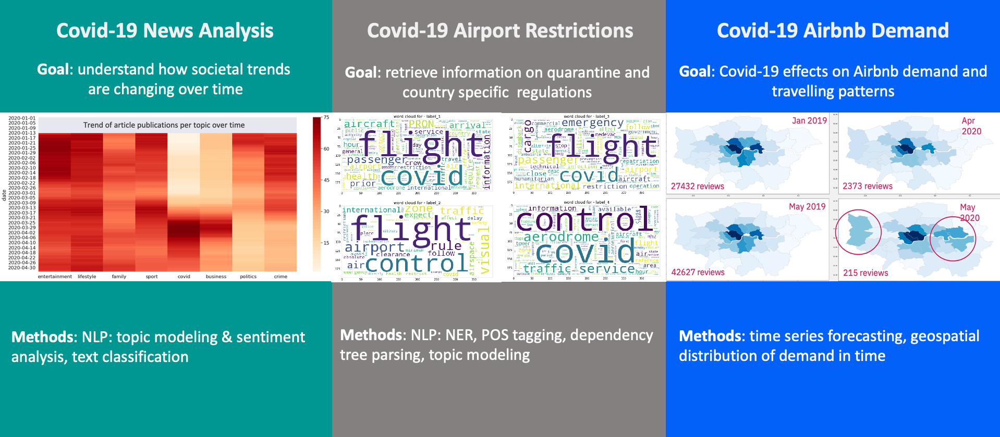
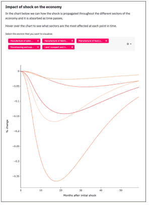

# Workstreams

The _Regional Risk-Pulse Index_ project is organised into three broad thematic categories or workstreams:
* **WS1 - Emergent Risk Index.** When is it the right time for local authorities to intervene based on the health status of a region?
* **WS2 - Emergent Pulse.** How are people feeling and behaving as a result of the measures against Covid-19? 
* **WS3 - Economic Scenario Modelling.** How are shocks to specific industrial sectors affect the whole economy (restaurant shutdowns, air travel restrictions, etc)? 
Under these thematic categories, we have developed a wide array of interconnected analyses which are outlined below. 

# WS1 - Emergent Risk Index
## Health Risk Index
A composed regional risk index that takes into account the level of infection rate, % of vulnerable population, and many other factors to assess the ‘riskiness’ of a specific region. How can we help local authorities to decide when is the right time to intervene? 

## Geospatial
A geospatial knowledge of the world with respect to neighbourhood relationships at country and sub-country level. It includes a [Jupyter notebook](ws1/geospatial/WS3_kp_Knowledge_Graph.ipynb) that executes parallel threads without the need for a running `ipyparallel` instance , see computation of neighbours at the bottom

## Labelling tool
A tagging tool for humans to annotate infection waves.

# WS2 - Emergent Pulse
The aim of this workstream is to create a series of index that can describe the status of a region, for example: What is the sentiment of the population of that region? How are they behaving? How are the news and social media changing? How is the tourism industry being affected?. This image gives an overview of some of the topics covered in this workstream.

## News Analysis
The News Analysis folder contain the analysis done on a corpus of news articles to understand the trends of frequency and sentiment of articles over time, and to perform binary classification on a topic of interest. Please note that this folder contains only code and the news data need to be provided by the user.  The following provides a brief overview of the different notebooks available in the folder:

* ws2_1_data_preparation.ipynb - preprocessing of textual data in English.
* ws2_1_2_data_preparation_language.ipynb - preprocessing of textual data, German and French languages are added.
* ws2_2_topic_modelling.ipynb - topic modeling of articles.
* ws2_3_sentiment_analysis.ipynb - sentiment analysis of articles.
* ws2_4_heatmaps.ipynb - creating heatmaps of frequency and sentiment of articles over time.
* ws2_5_text_classification.ipynb - binary classification pipeline.

The meltwater folder is a Python package that provides a client to access the Export APIs from Meltwater: https://developer.meltwater.com. Note that we do not provide an interface to all the endpoints exposed by API. We only provide an interface to two groups of endpoints: the "searches" endpoints and the "One-time export" endpoints. However, the client can easily be extended to include the other groups of endpoints. 

## Social Media Analysis
Stemming from the News Analysis and part of our collaboration with the NHS in Nottinghamshire, here we use data from Twitter to look at the perception of vaccines and lockdown measures in the Nottingham and Liverpool areas, as well as mental wellness. Twitter data allows us to monitor what type of information around Covid-19 is being shared in a local area. Some of the work we’ve done so far includes:
* Analyse the content of tweets. We can infer the sentiment and emotions associated to a body of text. Based on its content, we can also classify it with similar tweets that share a common “topic” using Topic Modelling techniques.
* Identify what type information is more popular in an area (viral tweets).
* Identify who are key spreaders of such information - or influencers.

## Mobility and Tourism
Here we use NOTAMS data to extract information on international travel restrictions to and from several countries. We also use Airbnb data to study how travelling patterns changed in the UK after the onset of the pandemic. 

### NOTAMS
The folder - airport_restrictions contain the analysis done on NOTAM data and travel restriction data from Humanitarian exchange to extract quarantine and country restrictions. Please note that this folder contains only code and the NOTAM data will have to be downloaded manually. The following provides a brief overview of the different notebooks available in the folder:

* ws2_snr_NOTAMs_1_data_preparation.ipynb - Basic preprocessing of NOTAM - removing special characters, expanding abbreviations, removing stop words.
* ws2_snr_NOTAMs_2_topic_modeling.ipynb -  Identification of different topics present in the NOTAM.
* ws2_snr_notams_3_quarantine_text.ipynb -  Extraction of quarantine duration from NOTAM using Named Entity Recognition (NER) and regex.
* ws2_snr_NOTAMs_1_data_preparation_mulitple files.ipynb - Similar to the first notebook on data preparation. Iteration of data preprocessing to multiple files.
* ws2_snr_NOTAMs_country_level_restrictions_timeline.ipynb - Information extraction of restriction on foreigners using NER, Part of speech tagging and dependency parser.
* ws2_snr_humdata_country_level_restriction_timeline.ipynb - Information extraction of restriction on foreigners using the same set of rules used in the above notebook on a different data source (travel restriction data from humanitarian exchange)
* ws2_snr_validation_information_extraction_rules.ipynb - validation of the information extraction rules based on the results generated using NOTAM and travel restriction data from humanitarian exchange
* ws2_snr_travel_advisory_data_download.ipynb - travel risk index from travel-advisory website that provides a travel risk index for each country based on the travel advisories from different foreign countries.

Named Entity Recognizer was used to identify country names mentioned in the data.

Part of speech tagging was used to identify the verbs in the sentences and rules were used to determine if the verb had a positive or negative connotation.

### Airbnb
The Airbnb folder contains the analysis done on the InsideAirbnb data: http://insideairbnb.com/get-the-data.html. The aim of this analysis is to offer data-driven insights into the new trends in tourism and hospitality. The following summarises the content of Airbnb notebooks.

* Predictive_Model.ipynb - Predictive model using FBProphet that characterizes the expected Airbnb demand if Covid-19 pandemic did not happen. 
* Geo_Distribution_Tourism.ipynb - Geo distribution of the Airbnb demand in cities around the world.

## Our Results
The following blog posts can provide more information on the analysis and results of our work:

* [Topic modeling of newspapers](https://emergentalliance.org/?p=1628)
* [Sentiment analysis of newspapers](https://emergentalliance.org/?p=1638)
* [Covid-19 News Classification](https://emergentalliance.org/?p=1669)
* [Impact of COVID-19 on tourism](https://emergentalliance.org/?p=1680)

# WS3 - Economic Scenario Modelling
We create an economic scenario modelling tool, the Emergent Economic Engine, to simulate how shocks to some industries may propagate to the rest of a networked economy. These shocks can be in the form of sectorial shutdowns, travel restrictions. The tool also offeres the possibility of counteracting these measures by injecting resources into the economy. The folder is organised into two subfolders:

* [Economic documentation](("Economic Scenario Modelling - WS3"/"Economic documentation")), where we explain the basics of the Leontief Input-Output model and how we can shock it from a dynamic and a static point of view. 
* [Simulation engine app]("Economic Scenario Modelling - WS3"/"Simulation engine app"), where we have the source code of the Emergent Economic Engine and the associated Input-Output tables.

## Our Results
In the following posts we explain the theory behind our model and the Emergent Economic Engine. 

* [Input-Output Economics and the Impact of Covid-19](https://emergentalliance.org/?p=1689)
* [Modelling Economic Interventions to Fight Covid-19](https://emergentalliance.org/?p=1832)

