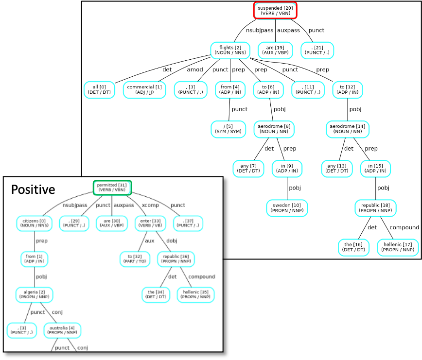

# Code from Workstream 2: Emergent Pulse 

The aim of this workstream is to create a series of index that can describe the status of a region, for example; What is the sentiment of the population of that region? How are they behaving? How the news and Media changing? How is the tourism industry being affected?

The following sections present the code published for analyzing different datasets within our workstream: 

## News analysis

The News-analysis folder contain the analysis done on a corpus of news articles to understand the trends of frequency and sentiment of articles over time, and to perform binary classification on a topic of interest. Please note that this folder contains only code and the news data need to be provided by the user.  The following provides a brief overview of the different notebooks available in the folder:

* ws2_1_data_preparation.ipynb - preprocessing of textual data in English.
* ws2_1_2_data_preparation_language.ipynb - preprocessing of textual data, German and French languages are added.
* ws2_2_topic_modelling.ipynb - topic modeling of articles.
* ws2_3_sentiment_analysis.ipynb - sentiment analysis of articles.
* ws2_4_heatmaps.ipynb - creating heatmaps of frequency and sentiment of articles over time.
* ws2_5_text_classification.ipynb - binary classification pipeline.

## NOTAM analysis

The folder - airport_restrictions contain the analysis done on NOTAM data and travel restriction data from Humanitarian exchange to extract quarantine and country restrictions. Please note that this folder contains only code and the NOTAM data will have to be downloaded manually. The following provides a brief overview of the different notebooks available in the folder:

* ws2_snr_NOTAMs_1_data_preparation.ipynb - Basic preprocessing of NOTAM - removing special characters, expanding abbreviations, removing stop words.
* ws2_snr_NOTAMs_2_topic_modeling.ipynb -  Identification of different topics present in the NOTAM.
* ws2_snr_notams_3_quarantine_text.ipynb -  Extraction of quarantine duration from NOTAM using Named Entity Recognition (NER) and regex.
* ws2_snr_NOTAMs_1_data_preparation_mulitple files.ipynb - Similar to the first notebook on data preparation. Iteration of data preprocessing to multiple files.
* ws2_snr_NOTAMs_country_level_restrictions_timeline.ipynb - Information extraction of restriction on foreigners using NER, Part of speech tagging and dependency parser.
* ws2_snr_humdata_country_level_restriction_timeline.ipynb - Information extraction of restriction on foreigners using the same set of rules used in the above notebook on a different data source (travel restriction data from humanitarian exchange)
* ws2_snr_validation_information_extraction_rules.ipynb - validation of the information extraction rules based on the results generated using NOTAM and travel restriction data from humanitarian exchange
* ws2_snr_travel_advisory_data_download.ipynb - travel risk index from travel-advisory website that provides a travel risk index for each country based on the travel advisories from different foreign countries.

Named Entity Recognizer was used to identify country names mentioned in the data.

Part of speech tagging was used to identify the verbs in the sentences and rules were used to determine if the verb had a positive or negative connotation.

## Airbnb analysis

The Airbnb folder contains the analysis done on the InsideAirbnb data: http://insideairbnb.com/get-the-data.html. The aim of this analysis is to offer data-driven insights into the new trends in tourism and hospitality. The following summarises the content of Airbnb notebooks.

* Predictive_Model.ipynb - Predictive model using FBProphet that characterizes the expected Airbnb demand if Covid-19 pandemic did not happen. 
* Geo_Distribution_Tourism.ipynb - Geo distribution of the Airbnb demand in cities around the world.

## Meltwater python client

The meltwater folder is a Python package that provides a client to access the Export APIs from Meltwater: https://developer.meltwater.com. Note that we do not provide an interface to all the endpoints exposed by API. We only provide an interface to two groups of endpoints: the "searches" endpoints and the "One-time export" endpoints. However, the client can easily be extended to include the other groups of endpoints. 

## Social Media
The Social Media forlder contains our analysis of Twitter data in the local areas of Nottingham and Liverpool. Twitter data allows us to monitor what type of information around Covid-19 is being shared in a local area. Some of the work we’ve done so far includes:
* Analyse the content of tweets. We can infer the sentiment and emotions associated to a body of text. Based on its content, we can also classify it with similar tweets that share a common “topic” using Topic Modelling techniques.
* Identify what type information is more popular in an area (viral tweets).
* Identify who are key spreaders of such information - or influencers.

## Our Results
The following blog posts can provide more information on the analysis and results of our work:

* [Topic modeling of newspapers](https://emergentalliance.org/?p=1628)

* [Sentiment analysis of newspapers](https://emergentalliance.org/?p=1638)

* [Covid-19 News Classification](https://emergentalliance.org/?p=1669)

* [Impact of COVID-19 on tourism](https://emergentalliance.org/?p=1680)
 
## Team

IBM:
* **Mehrnoosh Vahdat** is Data Scientist with Data Science & AI Elite team where she specializes in Data Science, Analytics platforms, and Machine Learning solutions.
* **Vincent Nelis** is Senior Data Scientist with Data Science & AI Elite team where he specializes in Data Science, Analytics platforms, and Machine Learning solutions.
* **Anthony Ayanwale** is Data Scientist with CPAT team where he specializes in Data Science, Analytics platforms, and Machine Learning solutions.   
* **Álvaro Corrales Cano** is a Data Scientist within IBM's Cloud Pak Acceleration team. With a background in Economics, Álvaro specialises in a wide array Econometric techniques and causal inference, including regression, discrete choice models, time series and duration analysis.
* **Ananda Pal** is a Data Scientist and Performance Test Analyst at IBM, where he specialises in Data Science and Machine Learning Solutions.

Rolls Royce:
* Shri Nishanth Rajendran - AI Development Specialist, R² Data Labs, Rolls Royce
* Maria Ivanciu is AI Developer in R2 Data Labs, Rolls-Royce. 
